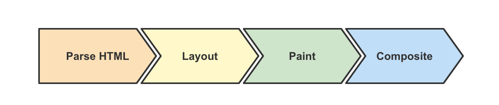

# 渲染原理

## 关键词

- `DOM`
- `CSSOM`
- `脚本执行与界面渲染互斥`
- `渲染树`
- `Compositing合成树`
- `GPU 加速`

## 浏览器渲染的关键路径

1. Parse HTML：相关引擎分别解析文档和样式表以及脚本，生成 DOM 和 CSSOM ，最终合成为 Render 树。
2. Layout：浏览器通过 Render 树中的信息，以递归的形式计算出每个节点的尺寸大小和在页面中的具体位置。
3. Paint：浏览器将 Render 树中的节点转换成在屏幕上绘制实际像素的指令，这个过程发生在多个图层上。
4. Composite：浏览器将所有层按照一定顺序合并为一个图层并绘制在屏幕上。

## 步骤说明

1. 第一步：渲染引擎开始解析 html，根据标签构建 DOM 节点
2. 第二步：根据 css 样式构建渲染树，包括元素的大小、颜色，隐藏的元素不会被构建到该树中。
3. 第三步：根据 css 样式构建布局树，主要是确定元素要显示的位置。
4. 第四步：根据前面的信息，绘制渲染树

&nbsp;

# 重排重绘

重排和重绘，本质上指的就是触发 Layout 和 Paint 的过程，且重排必定导致重绘。

## 引起重排/重绘的常见操作

1. 外观有变化时，会导致`重绘`。相关的样式属性如 color opacity 等。
2. 布局结构或节点内容变化时，会导致`重排`。相关的样式属性如 height float position 等。
   - 盒子尺寸和类型。
   - 定位方案（正常流、浮动和绝对定位）。
   - 文档树中元素之间的关系。
   - 外部信息（如视口大小等）。
3. 获取布局信息时，会导致`重排`。相关的方法属性如 offsetTop getComputedStyle 等。

## 何减少重排重绘

### 意义

大多数显示器的刷新率是 60FPS（frames per second）。理想情况下，浏览器需要在 1/60 秒内完成渲染阶段并交付一帧。这样用户就会看到一个交互流畅的页面。

在交互阶段，页面更新（一般是通过执行 JavaScript 来触发）通常会触发重排和重绘。为了提升浏览器渲染效率，应当尽可能减少重绘重排（跳过 Layout/Paint 步骤），从而降低浏览器渲染耗费的时间，将内容尽快渲染到屏幕上。

### 解决方案

1. 对 DOM 进行批量写入和读取（通过虚拟 DOM 或者 DocumentFragment 实现）。
2. 避免对样式频繁操作，了解常用样式属性触发 Layout / Paint / Composite 的机制，合理使用样式。
3. 合理利用特殊样式属性（如 transform: translateZ(0) 或者 will-change），将渲染层提升为合成层，开启 GPU 加速，提高页面性能。
4. 使用变量对布局信息（如 clientTop）进行缓存，避免因频繁读取布局信息而触发重排和重绘。

另外，可以借助 DevTools Performance 面板来查看产生重排重绘任务占用主线程的情况和调用代码。

## 参考

- [浏览器渲染原理](https://febook.hzfe.org/awesome-interview/book2/browser-render-mechanism)
- [浏览器的重排重绘](https://febook.hzfe.org/awesome-interview/book1/browser-repain-reflow)
